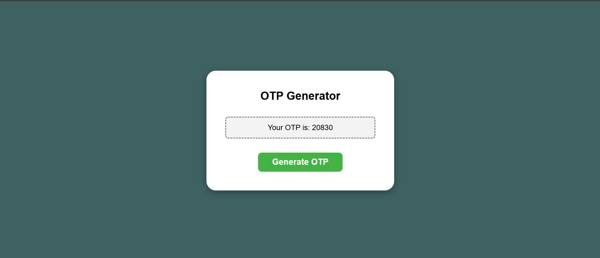

# OTP Generator

A simple, elegant, and efficient OTP (One-Time Password) Generator built using **HTML**, **CSS**, and **JavaScript**. This project allows users to instantly generate secure OTPs for authentication, verification, or any use case needing a quick, random code.

---

## 🚀 Live Demo

[🔗 View Live OTP Generator](https://saurabh-otp-generator.netlify.app/)

---

## 📸 Screenshot



---

## ✨ Features

- **Instant OTP Generation:** Generate secure, random OTPs at the click of a button.
- **Customizable Length:** Easily adjust the length of the OTP as needed.
- **User-Friendly Interface:** Clean, responsive, and intuitive design.
- **Clipboard Support:** Effortlessly copy OTPs for quick use.
- **Lightweight:** No external dependencies—pure HTML, CSS, and JavaScript.

---

## 🛠️ How It Works

1. **Open the Live Demo** or download and open `index.html` in your browser.
2. **Set OTP Length** (if supported).
3. **Click “Generate OTP”** to get your new secure code.
4. **Copy OTP** to clipboard and use as needed.

---

## 📂 Project Structure

```
otp-generator/
├── index.html
├── style.css
└── script.js
```

---

## 📦 Getting Started

1. **Clone the Repository**
   ```bash
   git clone https://github.com/yourusername/otp-generator.git
   ```
2. **Open `index.html`**
   - Just double-click to launch in your browser!

---

## 💡 Customization

- **OTP Length:** Modify in the UI or edit the JavaScript for default values.
- **Styling:** Tweak `style.css` to match your branding or style preferences.
- **Integration:** Easily embed the generator into your own websites or projects.

---

## 🤝 Contributing

Contributions are welcome! Feel free to open issues or submit pull requests to improve the project.

---

## 📃 License

This project is open-source and available under the [MIT License](LICENSE).

---

## 🙌 Acknowledgments

- Inspired by the need for simple, client-side authentication solutions.
- Built with love using web standards.

---

> **Built by Me**  
> For any queries or suggestions, feel free to reach out!

---

**Built with ❤️ using HTML, CSS, and JavaScript.**